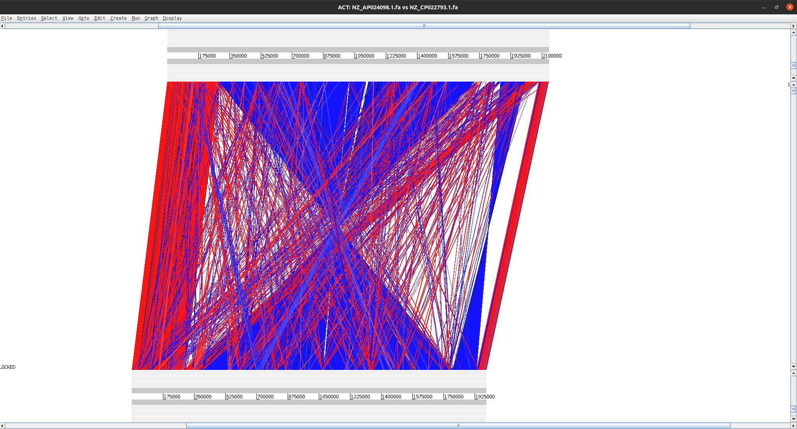

# easy_bwast

Easy **B**last **W**rapper **A**nd **S**equence **T**rimmer 

Given `n` accessions, downloads the fasta for each accession from NCBI, run command-line BLAST on these fastas, 
and loads the comparison up in ACT, *in just one step*.

This is just a simple wrapper on [bwast](https://github.com/bawee/bwast) so that there is no need to download the
sequences from NCBI yourself, and is easier to install.

## Quick view

Running:
```
./easy_bwast.py -e <your_email> NZ_AP024098.1 NZ_CP022793.1
```

will download the fasta for both accessions, run `blast` and load the alignments on ACT, and show this screen to you:
. We download accessions with NCBI Entrez, which requires you to specify your email
address with each request.

## Installing dependencies

Create the `conda` env running: `conda env create -f environment.yaml`.
Then just activate the environment to use `easy_bwast`.

## Usage

```
$ ./easy_bwast.py -h
usage: easy_bwast.py [-h] -e EMAIL input [input ...]

Wrapper script to run blast and ACT on accessions without needing to download
them.

positional arguments:
  input                 Specify at least 2 accessions with versions (e.g.
                        NZ_AP024098.1, NZ_CP022793.1, etc)

optional arguments:
  -h, --help            show this help message and exit
  -e EMAIL, --email EMAIL
                        NCBI requires you to specify your email address with
                        each request.
```

## TODO

* Enable all CLI options from [bwast](https://github.com/bawee/bwast);
* Make `bioconda` package;
